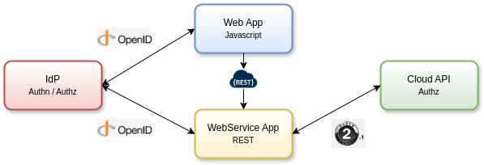

# TP Web Services Sécurisés / Microservices

## Objectifs du TP
* **Mise en place d'un backend** servant des Web Services REST.
* **Mise en place d'une application frontend JavaScript** appelant depuis le navigateur les WS REST.
* **Mise en place d'un appel vers une API externe** depuis le backend avec délégation d'autorisation via OAuth 2.1.
* **Protection du Web Service REST**.

> [!NOTE]
> Pour chaque étape du TP, les groupes réaliseront une petite analyse (quelques lignes) présentant la solution mise en place et synthétisant les difficultés rencontrées ainsi que les possibilités d'améliorations envisagées.
>
> Le travail de chaque groupe sera remis à la fin du TP avec une note explicative sur la façon de déployer et de tester les Web Services réalisés.

---

## Présentation
Le TP consistera à mettre en œuvre trois composants :
* **Single Page Application** : application JavaScript tournant dans le navigateur et fournissant une interface web de réservation de vols d'avions.
* **Application REST backend** : application REST proposant des Web Services de récupération et de réservation de vols.
* **Serveur Identity Provider (IdP)** : serveur d’authentification et d’autorisation supportant le protocole OpenID Connect.

Le but est de faire communiquer de façon sécurisée les différentes applications entre elles en déléguant l'authentification et les autorisations des utilisateurs à un serveur tiers grâce à OpenID Connect.



---

## Déroulement du TP

### 1 - Mise en place de l'application REST
Ce Web Service REST, représentant un service de réservation de vols, permet de récupérer une ressource « vol » (comprenant une compagnie aérienne, un numéro de vol, une place, un prix et une date).

Les Web Services construits doivent être statiques (i.e. sans traitement particulier ni accès à une base de données), l'important étant la mise en place d'une API REST.

* **1a** : Créer un projet Java Web avec votre IDE favori.
  Avec Maven :
  ```bash
  mvn archetype:generate \
    -DgroupId=infres.ws.rest \
    -DartifactId=java-rest-server \
    -DarchetypeArtifactId=maven-archetype-webapp \
    -DarchetypeVersion=1.4 \
    -DinteractiveMode=false
  ```
* **1b** : Concevez l'arborescence et la hiérarchie de ressources REST correspondant aux entités `{compagnie}`, `{vol}`, `{place}` et `{date}`.
* **1c** : Créer un service REST permettant de récupérer une ressource objet Java « vol » sous sa représentation XML (binding JAXB).
* **1d** : Passer du format XML au format JSON tout en gardant le binding JAXB.

---

### 2 – Mise en place de l'application JavaScript
L'application JavaScript (servie statiquement par l'application REST ou par un serveur web HTTP externe) appelle le Web Service de réservation de vols et affiche le résultat dans le navigateur de l'utilisateur.

---

### 3 – Mettre en place une délégation d'autorisation OAuth 2.1 auprès d'un fournisseur d'API public (Google, Facebook, Twitter…)
L'application REST accédera à une API d'un fournisseur d'API public supportant OAuth 2.1 et récupérera les informations de l'utilisateur/profil depuis le fournisseur en question pour les afficher sur la page d'accueil de l'application Web.

* **3a** : Inscrire auprès du fournisseur d'API votre application consommatrice REST (i.e. récupération d'un `client_id` et d'un `client_secret`) :
  1. Créer un projet ou une application auprès du fournisseur d'API choisi.
  2. Éventuellement valider/activer les APIs que vous souhaitez utiliser et bien spécifier les scopes d'API utilisables par votre client.
  3. Créer des credentials pour votre client/application en récupérant bien un `client_id` et un `client_secret`.
  4. Configurer une URL de redirection en `localhost` redirigeant vers votre projet d'application REST sur le endpoint qui gérera le retour du code d'autorisation.
* **3b** : Mettre en place le processus OAuth 2.1 entre l'application Web et le fournisseur d'API via des librairies OAuth 2.1 présentes dans l'écosystème technologique du serveur REST.
  Le processus est souvent à réaliser en deux étapes via la mise en place de deux endpoints web :
  1. Une URL de login qui permet d'enclencher le flux de demande de code d'autorisation auprès du fournisseur d'API (e.g. implémentation de `AbstractAuthorizationCodeServlet` avec la bibliothèque OAuth de Google).
  2. Une URL de callback qui permet de recevoir le code d'autorisation et de l'échanger contre un access token (e.g. implémentation de `AbstractAuthorizationCodeCallbackServlet` avec la bibliothèque OAuth de Google).
* **3c** : Récupérer les informations de profil de l'utilisateur depuis l'application REST auprès du fournisseur d'API grâce à l'access-token et les afficher dans l'application Web.

---

### 4 - Déléguer l'autorisation d'accès à l'API REST auprès d'un serveur OpenID Connect
L'application REST déléguera l'autorisation d'accès à ses APIs à un serveur d'autorisation tiers supportant le protocole OpenID Connect.

* **4a** : Installer le serveur Keycloak (serveur d'authentification et d'autorisation) localement ou via Docker.
* **4b** : Configurer votre application REST en tant que client de type « bearer-only » (API) au sein du serveur Keycloak. Le tutoriel suivant peut vous aider : [Katacoda - Secure Service](https://www.katacoda.com/keycloak/courses/keycloak/secure-service)
* **4c** : Récupérer la configuration JSON du client REST depuis Keycloak et configurer votre application REST via l'adapter Keycloak correspondant à votre environnement technologique. Voir [Documentation Keycloak - Securing Apps](https://www.keycloak.org/docs/latest/securing_apps/)

> [!WARNING]
> Les adapters (librairies clientes) Keycloak disparaîtront à moyen terme ! Il faudra alors utiliser une librairie OIDC standard dans votre langage de programmation.

* **4d** : Valider que votre API est bien sécurisée (i.e. retour HTTP 403 si accès sans token).

---

### 5 - Déléguer l'authentification de l'application Web auprès du serveur OpenID Connect Keycloak
L'application Web déléguera l'authentification de ses utilisateurs auprès du serveur OpenID Connect.

* **5a** : Configurer votre application Web en tant que client de type « public » au sein du serveur Keycloak.
* **5b** : Récupérer la configuration JSON du client Web depuis Keycloak et configurer votre application Web via l'adapter Keycloak correspondant à votre environnement technologique. Voir [Documentation Keycloak - Securing Apps](https://www.keycloak.org/docs/latest/securing_apps/)

> [!WARNING]
> Les adapters (librairies clientes) Keycloak disparaîtront à moyen terme ! Il faudra alors utiliser une librairie OIDC standard dans votre langage de programmation.

* **5c** : Déléguer l'authentification à Keycloak dans votre application Web et vérifier que vous récupérez bien un JWT contenant votre ID d'utilisateur ainsi qu'un token d'API vous permettant d'accéder à l'application REST.

---

### 6 – Analyser le token JWT généré par Keycloak
* **6a** : Récupérer le token JWT en analysant les requêtes HTTP vers Keycloak.
* **6b** : Copier/coller le token JWT sur le site [jwt.io](https://jwt.io/) et analyser le résultat.

---

### 7 – Définir un contrat d'API avec OpenAPI
* **7a** : Utiliser l'éditeur Swagger ([swagger.io/tools/swagger-editor](https://swagger.io/tools/swagger-editor/)) pour définir votre contrat d'API.
* **7b** : À partir du contrat, générer :
  * La documentation HTML de votre API
  * Les librairies clientes qui permettront d'accéder à votre API

---

### 8 – Mettre en place un outil de management d'API
* **8a** : Installer l'outil Gravitee : [docs.gravitee.io](https://docs.gravitee.io/)
* **8b** : Créer une nouvelle API au sein de Gravitee :
  * Importer votre contrat OpenAPI
  * Lier vos services backend à cette API Gravitee
  * Configurer une politique d'accès à votre API (rate limiting par exemple)
  * Tester l'accès à votre API en passant par la gateway Gravitee
