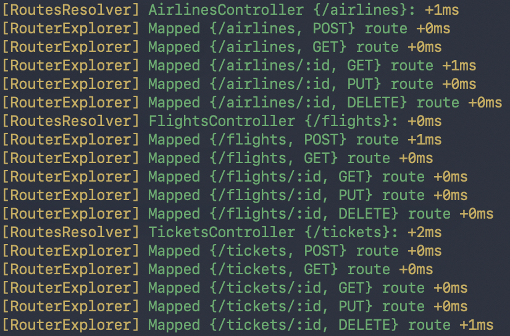
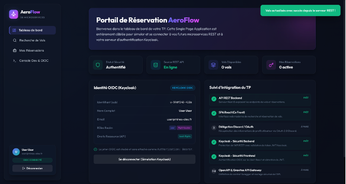
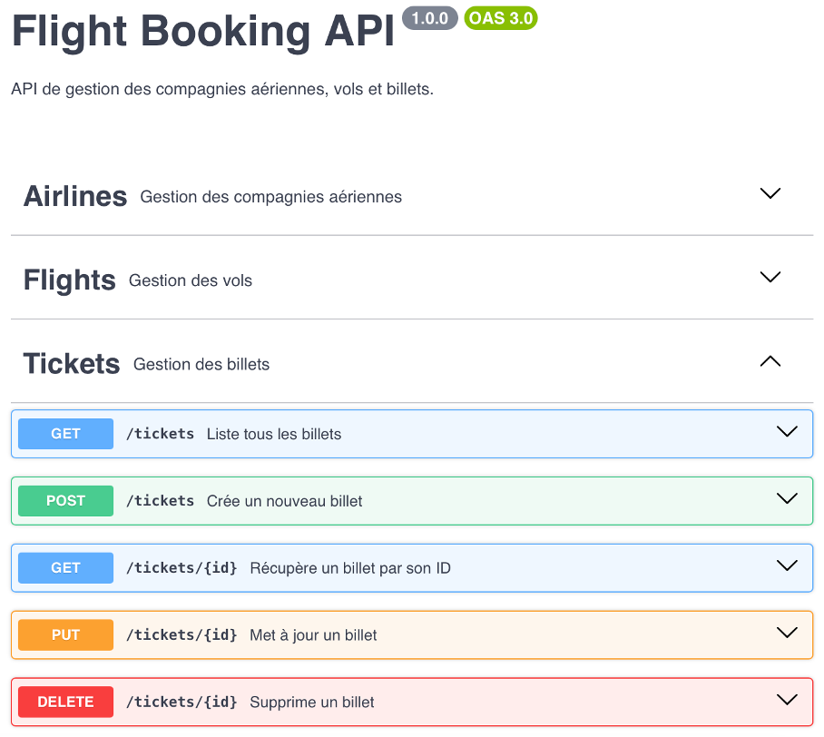

# Rapport TP - Web Services Sécurisés

**Auteur :** Alban DAVID - Laurent Boualavong

---

## 0 - Introduction

Ce TP a pour objectif de concevoir et déployer une architecture web complète en trois composants : une Single Page Application JavaScript, un backend REST et un serveur Identity Provider. Ces éléments communiquent de façon sécurisée via le protocole OpenID Connect, permettant de déléguer l'authentification et les autorisations à un serveur tiers selon les principes d'OAuth 2.1. L'application ainsi construite offre un service de réservation de vols où la sécurité des échanges entre le frontend, le backend et les API externes est au cœur de la mise en œuvre.

---

## 1 - Mise en place de l'application REST

Nous avons choisi de développer le backend en **TypeScript** à l'aide du framework **NestJS**.

Trois ressources REST ont été mises en place, reflétant la hiérarchie métier du domaine aérien :

- **`/airlines`** - CRUD pour gérer les compagnies aériennes (nom, code pays ISO 3166-1 alpha-2)
- **`/flights`** - CRUD pour gérer les vols d'une compagnie (aéroports de départ/arrivée en code IATA, date)
- **`/tickets`** - CRUD pour gérer les billets d'un vol (classe economy/business/first, siège, passager, prix)

Les données sont stockées en mémoire (tableaux TypeScript avec auto-incrément d'ID), sans base de données, conformément à la consigne. Les DTOs NestJS assurent la validation des entrées (longueur des codes IATA, format des codes pays ISO, format du siège) et retournent des erreurs HTTP 400 explicites en cas de données invalides.



---

## 2 - Application JavaScript

Afin d'avoir une interface agréable sans passer trop de temps dessus car il ne s'agit pas du sujet du TP, les interfaces de la SPA (Single Page Application) ont été entièrement faites avec l'aide de l'IA. Il s'agit d'une application **React 18 + Vite** nommée *AeroFlow*, exposant quatre vues :

- **Dashboard** - résumé du compte et statut de connexion
- **Recherche de vols** - liste les vols depuis l'API et permet la réservation
- **Mes réservations** - liste et annulation des billets
- **Dev Console** - outil de debug permettant de configurer dynamiquement les URLs de l'API et de Keycloak

On utilise notamment la librairie **`keycloak-js`** qui permet de gérer une instance Keycloak pour avoir accès aux fonctions de connexion/déconnexion en JavaScript. L'application est servie sur le port 5173 via `vite preview` (build statique).



---

## 3 - OAuth 2.1 auprès d'un fournisseur d'API public

Pour cette partie, nous avons fait le choix d'utiliser **Discord** comme provider pour mettre en place l'OAuth 2.1. Nous avons créé une nouvelle application dans le portail développeur Discord afin de récupérer le `client_id` et le `client_secret`, et défini notre URL de callback sur laquelle le provider doit nous rediriger une fois la connexion réussie (`http://localhost:3000/auth/discord/callback`).

Deux endpoints ont été implémentés côté backend pour couvrir le flux Authorization Code :

1. **`GET /auth/discord/login`** - redirige l'utilisateur vers l'URL d'autorisation Discord en passant le `client_id`, la `redirect_uri` et le scope `identify+email`
2. **`GET /auth/discord/callback`** - reçoit le code d'autorisation renvoyé par Discord, l'échange contre un `access_token` via une requête `POST` vers `https://discord.com/api/oauth2/token` (avec `client_id`, `client_secret` et `grant_type=authorization_code`), puis récupère les informations de profil (`username`, `email`, `avatar`) depuis `https://discord.com/api/users/@me`

Une fois le profil récupéré, le backend redirige vers le frontend en encodant les informations utilisateur dans les paramètres de l'URL. Le frontend détecte ces paramètres au chargement et affiche le profil Discord.

---

## 4 - Déléguer l'autorisation d'accès à l'API REST auprès d'un serveur OpenID Connect

Pour commencer nous avons lancé une instance Docker de **Keycloak 26.6.3** :

```bash
docker run -p 127.0.0.1:8080:8080 \
  -e KC_BOOTSTRAP_ADMIN_USERNAME=admin \
  -e KC_BOOTSTRAP_ADMIN_PASSWORD=admin \
  quay.io/keycloak/keycloak:26.6.3 start-dev
```

Dans l'interface Keycloak, on crée un royaume **`ema-s8-microservices`** ainsi qu'un client **`aeroflow-api`** (correspondant à notre API REST) configuré avec *client authentication ON* et *authorization ON*.

Les paramètres de connexion à Keycloak sont externalisés dans des variables d'environnement (`KEYCLOAK_URL`, `KEYCLOAK_REALM`).

Dans le fichier `jwt.strategy.ts`, on définit les contrôles effectués sur le token :
- **Signature** : vérification via la clé publique récupérée depuis l'endpoint JWKS de Keycloak (algorithme RS256)
- **Issuer** : le token doit être émis par notre realm (`http://keycloak:8080/realms/ema-s8-microservices`)
- **Audience** : le token doit inclure `aeroflow-api` ou `aeroflow-web` dans son champ `aud`

On utilise ensuite le guard standardisé de NestJS **`JwtAuthGuard`** avec la stratégie JWT. Pour appliquer ce guard à une route, il suffit d'ajouter le décorateur `@UseGuards(JwtAuthGuard)`. Sans token valide, l'API retourne **HTTP 401 Unauthorized**.

---

## 5 - Déléguer l'authentification de l'application Web auprès de Keycloak

Dans l'interface Keycloak dans notre realm, on crée un second client **`aeroflow-web`** (correspondant à l'application JavaScript) configuré avec *client authentication OFF* (client public, sans secret), *Standard Flow* activé. On définit `http://localhost:5173` comme Root URL et `http://localhost:5173/*` comme URI de redirection valide.

La stratégie de vérification du token est identique à celle du point 4, avec l'ajout du client `aeroflow-web` dans la liste des audiences autorisées.

Pour la connexion, on utilise la fonction `login()` de la librairie `keycloak-js` qui redirige l'utilisateur vers le portail de connexion de Keycloak. Une fois authentifié, le serveur Keycloak crée un cookie de session (associé à son domaine). De retour sur l'application, la fonction `init()` interroge Keycloak en arrière-plan pour vérifier la présence du cookie de session et restaure automatiquement l'authentification :

```js
keycloak.init({
  onLoad: 'check-sso',
  silentCheckSsoRedirectUri: window.location.origin + '/silent-check-sso.html',
  checkLoginIframe: false,
})
```

Le token est ensuite injecté dans tous les appels API via `Authorization: Bearer <token>`. On peut le consulter dans la Dev Console de l'application ou dans l'onglet Network des outils développeur du navigateur après un appel sécurisé à l'API.

---

## 6 - Analyser le token JWT généré par Keycloak

Une section dans l'application Dev Console permet directement de décoder et d'afficher le contenu du token JWT. Analysé sur [jwt.io](https://jwt.io), le payload expose notamment :

| Claim | Exemple | Signification |
|---|---|---|
| `iss` | `http://localhost:8080/realms/ema-s8-microservices` | Realm Keycloak émetteur |
| `sub` | `a3f2b1c0-...` | Identifiant unique de l'utilisateur (UUID) |
| `aud` | `["aeroflow-api", "aeroflow-web"]` | Audiences autorisées |
| `azp` | `aeroflow-web` | Client ayant initié l'authentification |
| `exp` / `iat` | timestamps Unix | Date d'expiration et d'émission |
| `preferred_username` | `testuser` | Nom d'utilisateur Keycloak |
| `realm_access.roles` | `["offline_access", ...]` | Rôles du realm |

La signature utilise l'algorithme **RS256**. La clé publique de vérification est disponible sur l'endpoint JWKS : `GET /realms/ema-s8-microservices/protocol/openid-connect/certs`.

Dans notre cas, on retrouve bien les données liées à l'utilisateur créé sur Keycloak.

---

## 7 - Définir un contrat d'API avec OpenAPI

Le contrat d'API a été défini manuellement dans le fichier **`api/swagger.yml`** au format **OpenAPI 3.0.3** à l'aide de l'éditeur Swagger Editor. Il documente l'ensemble des endpoints des trois ressources :

- **Airlines** : `GET /airlines`, `POST /airlines`, `GET /airlines/{id}`, `PUT /airlines/{id}`, `DELETE /airlines/{id}`
- **Flights** : même structure, avec paramètres de filtre `airline_id` et `date` en query string
- **Tickets** : même structure, avec filtres `flight_id` et `class`

Le contrat documente les contraintes de validation : codes IATA sur 3 caractères, codes pays ISO 3166-1 alpha-2, format de siège (`14A`), classe enum `economy/business/first`. Les codes de réponse HTTP sont couverts (200, 201, 204, 400, 404) avec des exemples de valeurs.

Les schémas réutilisables sont factorisés dans la section `components` via `$ref`, en distinguant soigneusement les schémas d'**entrée** (ex : `FlightInput` avec `airline_id` entier) des schémas de **sortie** (ex : `Flight` avec l'objet `Airline` imbriqué) :

```yaml
components:
  schemas:
    FlightInput:
      type: object
      required: [airline_id, departure_airport, arrival_airport, departure_date]
      properties:
        airline_id:
          type: integer
        departure_airport:
          type: string
          minLength: 3
          maxLength: 3
        ...
    Flight:
      allOf:
        - $ref: '#/components/schemas/FlightInput'
        - properties:
            id:
              type: integer
            airline:
              $ref: '#/components/schemas/Airline'
```



À partir de ce contrat, il est possible de générer :
- **La documentation HTML interactive** via Swagger UI (intégrable dans NestJS avec `@nestjs/swagger`)
- **Des librairies clientes typées** via `openapi-generator-cli` (TypeScript-Fetch, Python, etc.)

---

## 8 - Mettre en place un outil de management d'API

Pour cette étape, nous avons déployé **Gravitee API Management 4** via Docker Compose (`api/docker-compose-apim.yml`). L'infrastructure comprend cinq services : MongoDB (stockage de la config), Elasticsearch (logs et analytics), la Gateway (port 8082), la Management API (port 8083) et la Management UI (port 8084).

Une fois l'infrastructure démarrée, nous avons importé le contrat `swagger.yml` dans la console d'administration de Gravitee afin de déclarer notre API et de générer ses points d'accès sur la Gateway. Nous avons configuré le routage des requêtes en associant le chemin d'entrée `/flights-api` à l'adresse réseau du backend NestJS, accessible via l'IP de la passerelle Docker `http://172.20.0.1:3000`.

Afin d'exposer l'API, nous avons publié un plan d'accès public **Keyless** auquel nous avons greffé une règle de **Rate Limiting** : maximum 5 requêtes toutes les 10 secondes.

Pour tester l'ensemble de la chaîne, l'application frontend React a été reconfigurée dans sa Dev Console pour adresser toutes ses requêtes à l'URL de la Gateway Gravitee `http://localhost:8082/flights-api` au lieu du backend direct sur le port 3000, permettant de valider le respect de la limite de débit côté client.
